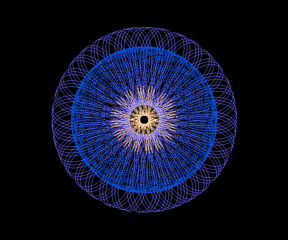
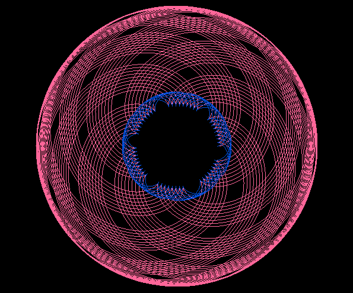
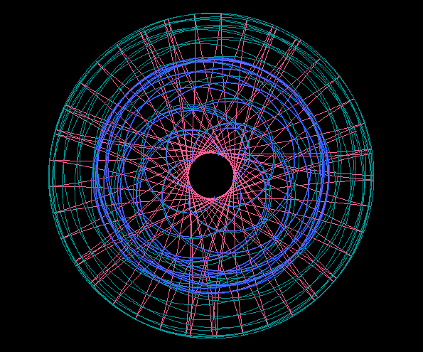

# Spiro

A programm that draws spirograph patterns using up to 4 different Trochoids:
Hypotrochoids, Epitrochoids, Hypocycloid and Epicycloids.
Here are some example images generated with Spiro:

	
	
	
	
	
	
	
	
	

### Build / Install

Make sure you have gloss installed.
To install gloss use:  
`$ cabal update`  
`$ cabal install gloss`

Clone this repo:  
`$ git clone https://github.com/lkamil/spiro.git`  
`$ cd spiro`  

Compile and run Spiro.hs using:    
`$ ghc -o spiro Spiro.hs && ./spiro`   