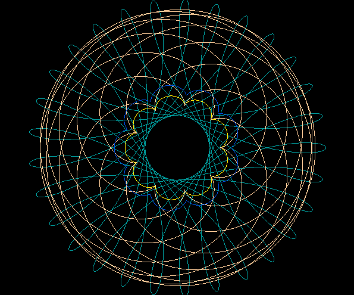
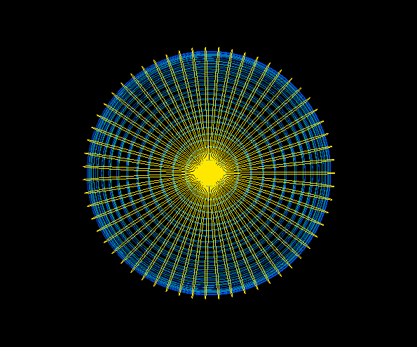
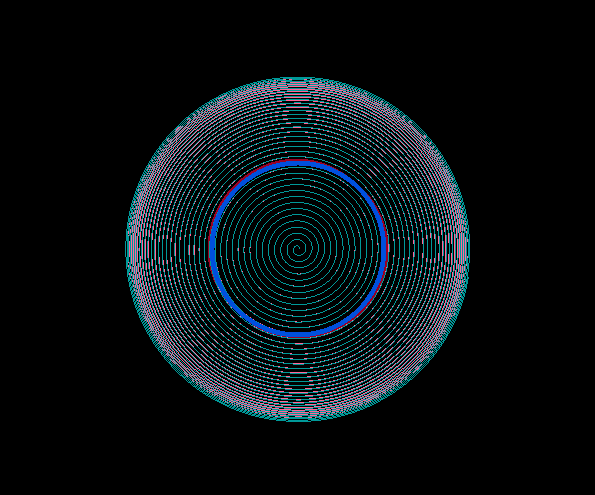

# Spiro

A programm that draws spirograph patterns using up to 4 different Trochoids:
Hypotrochoids, Epitrochoids, Hypocycloid and Epicycloids.
Here are some example images generated with Spiro:

<p align="center">
    
    
    
    
    
    
    
    
    
</p>

### Build / Install

Make sure you have gloss installed.
To install gloss use:  
`$ cabal update`  
`$ cabal install gloss`

Clone this repo:  
`$ git clone https://github.com/lkamil/spiro.git`  
`$ cd spiro`  

Compile and run Spiro.hs using:    
`$ ghc -o spiro Spiro.hs && ./spiro`

### Usage

To create different patterns play around with the 5 parameters: density, innerRadius, outerRadius,
distance and loops.  
[Here](https://en.wikipedia.org/wiki/Hypotrochoid) you can look up what these parameters mean in detail.

```haskell
-- parameters
innerRadius = 1     -- radius of the inner circle
outerRadius = 112   -- radius of the outer circle
distance    = 100   -- distance from the centre of the inner circle
loops       = 2     -- count of 360° loops
density     = 2000  -- higher density results in smoother lines

```
To generate a pattern you can combine all 4 trochoids or less. To add or delete a trochoid modify
the array in the  
function spiro.

```haskell
-- this version of spiro draws a dark blue epitrochoid on top of a light green epicycloid
-- on top of a ... you get the point :)
spiro :: Picture
spiro = pictures
    [ color darkred $ line drawHypotrochoid
    , color rosee $ line drawHypocycloid
    , color lightgreen $ line drawEpicycloid
    , color darkblue $ line drawEpitrochoid
    ]
```

Feel free to change the colors or add new colors using the function `makeColorI`
that takes 3 RGB values (from 0 to 255) and an alpha value that sets the transparency.

```haskell
seagrean = makeColorI 32 178 170 255
```
